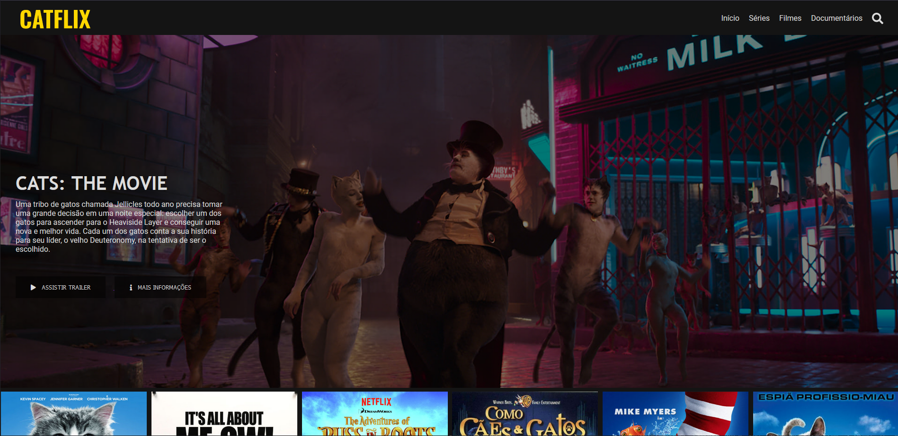
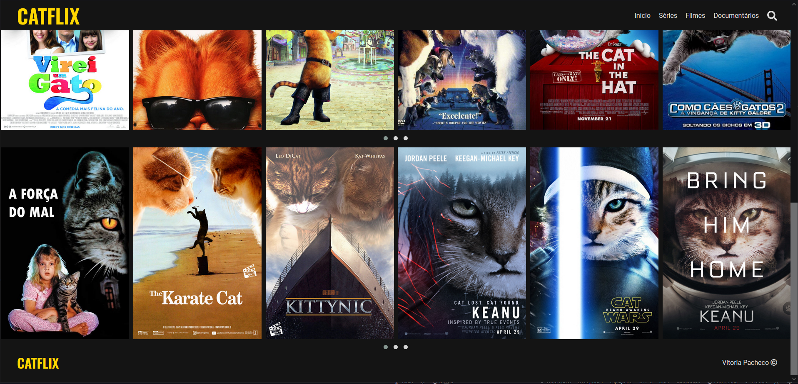

<h1 align="center">
  CATFLIX - Clone da Netflix
</h1>
<h2 align="center">Projeto feito para DIO</h2>

 

## &#9881; Tecnologias usadas no projeto

Esse projeto foi desenvolvido com as seguintes tecnologias:

- HTML
- CSS
- JavaScript

## 💻 Projeto

O projeto é recriar a página inicial da Netflix com pequenas modificações.
Se transformou na Catflix, uma página para filmes de gatos.
Foram inclusas o footer da página, header fixo, busca e carrosel duplo.

